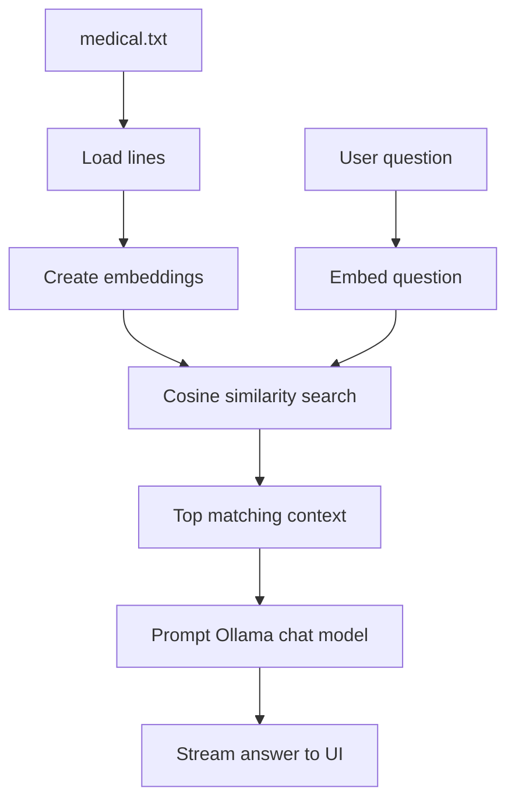

# Medical Knowledge Assistant

## Project Snapshot


Medical Knowledge Assistant is a small Retrieval-Augmented Generation (RAG) project that answers medical-style questions from a local knowledge file. It uses Ollama for embeddings and chat generation, and Streamlit for the user interface.

The goal is not to replace clinical advice. The app is designed to demonstrate how a local dataset can be turned into a searchable knowledge assistant with a simple, inspectable flow.

## Why Ollama Is Used

Ollama is used because it runs the embedding model and chat model locally, which keeps the project self-contained and easier to test. In this app, Ollama generates the embeddings used for retrieval and then generates the final answer from the retrieved context.

This approach is helpful because it:

- avoids sending the dataset and user questions to a cloud API,
- makes the retrieval and response pipeline easier to inspect,
- lets the app work with local models and local files only,
- keeps the demo simple for development and experimentation.

## Project Flow

1. The app reads `medical.txt`.
2. Each non-empty line is embedded with `nomic-embed-text`.
3. When a user asks a question, the question is embedded with the same embedding model.
4. The app compares the question vector against the dataset vectors using cosine similarity.
5. The top matching snippets are shown in the sidebar as the retrieved context window.
6. Those snippets are passed into `llama3.2:1b` as the only allowed context for the answer.
7. The model streams a response back to the Streamlit page.

## What’s Included

- `medical.txt` - the local medical knowledge dataset used for retrieval.
- `streamlit-app.py` - the main Streamlit app with embedding, retrieval, and chat response flow.
- `requirements.txt` - Python dependencies for the project.
- `README.md` - project overview, setup, and usage notes.

## Disclaimer

The content in this project is for informational purposes only and is not a substitute for professional medical advice, diagnosis, or treatment. Always consult a qualified healthcare provider for personal medical concerns.

## How It Works

The app follows a lightweight RAG pipeline:



The sidebar also shows the retrieved snippets and their similarity scores so you can see what context influenced the answer.

## Files

- `medical.txt` - local medical knowledge snippets and disclaimer.
- `streamlit-app.py` - Streamlit web UI that loads `medical.txt`, builds embeddings, and lets users ask questions.
- `ollama-app.py` - Simple CLI demo that loads `medical.txt`, builds embeddings, retrieves context, and streams a response from Ollama.
- `requirements.txt` - Python dependencies.

## Setup (Windows)

1. Create and activate a virtual environment in PowerShell:

```powershell
python -m venv venv
& "venv\Scripts\Activate.ps1"
```

2. Install the Python dependencies:

```powershell
pip install -r requirements.txt
```

3. Install Ollama and pull the models used if you use Ollama locally:

```powershell
# Install Ollama: follow https://ollama.com/docs
# Then pull the models referenced in the apps
ollama pull nomic-embed-text
ollama pull llama3.2:1b
```

## Run

Start the Streamlit UI:

```powershell
streamlit run streamlit-app.py
```

Run the CLI demo:

```powershell
python ollama-app.py
```

## Notes & Next Steps

- The dataset is intentionally local and easy to inspect.
- Retrieval quality depends on the amount and specificity of text in `medical.txt`.
- If the sidebar shows low similarity scores, the dataset usually needs more detailed topic coverage or smaller, more focused chunks.
- The app currently embeds each line independently, which keeps the implementation simple but can make headings compete with content if the dataset is too sparse.
- The app performs local retrieval over the `medical.txt` file and instructs the model to answer using only retrieved context. It does not provide medical advice.
- To improve the assistant: expand `medical.txt` by topic, add citation metadata, add a stronger safety system prompt, or connect to a vetted medical knowledge base.
- Add more topic-specific entries to `medical.txt`.
- Split the dataset into cleaner chunks with fewer heading-only lines.
- Add source labels or citations for each snippet.
- Improve the system prompt with more explicit safety rules.
- Connect the app to a vetted medical knowledge source if you want stronger factual coverage.

## Contact

If you want me to expand the dataset, add categories, or improve safety prompts, tell me which items to prioritize.
